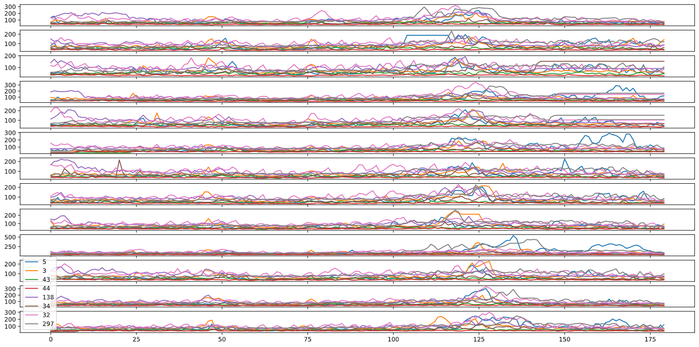
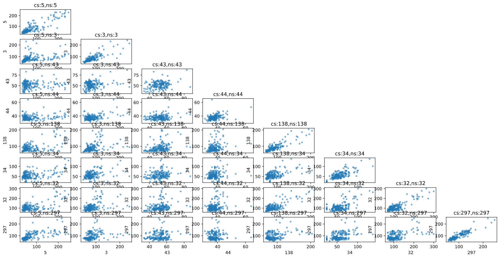
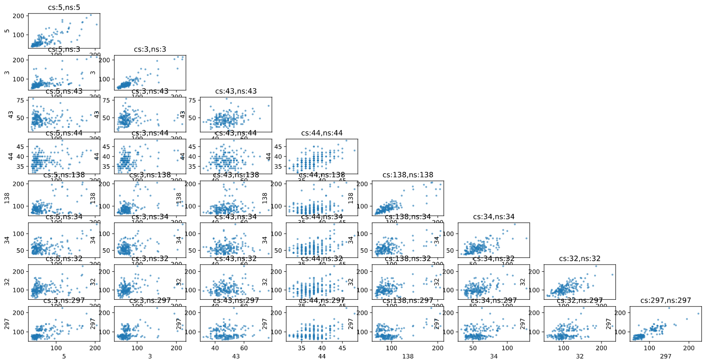
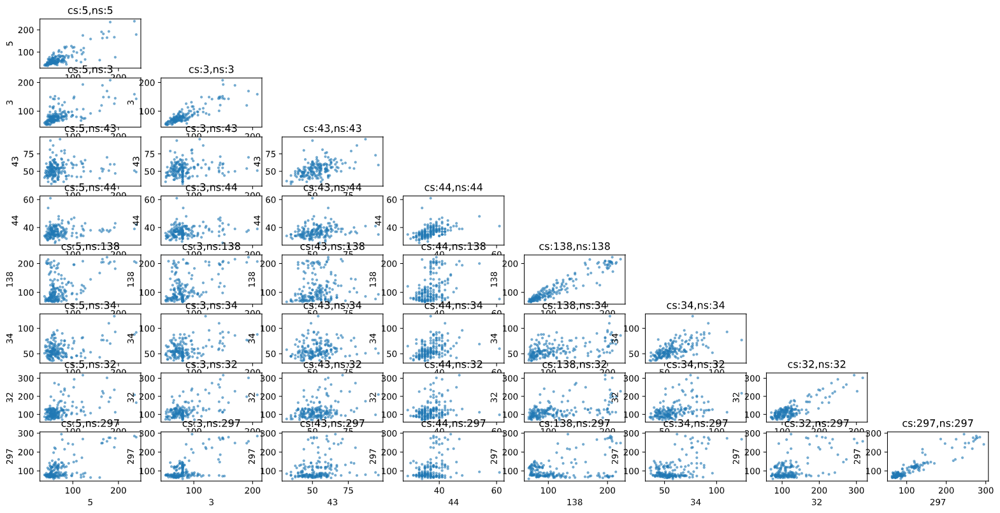
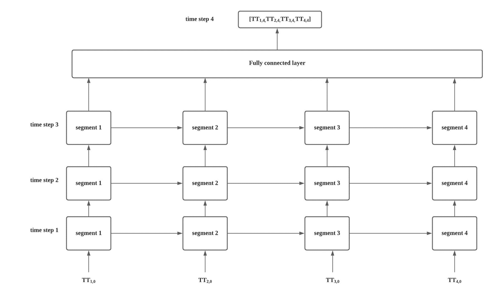
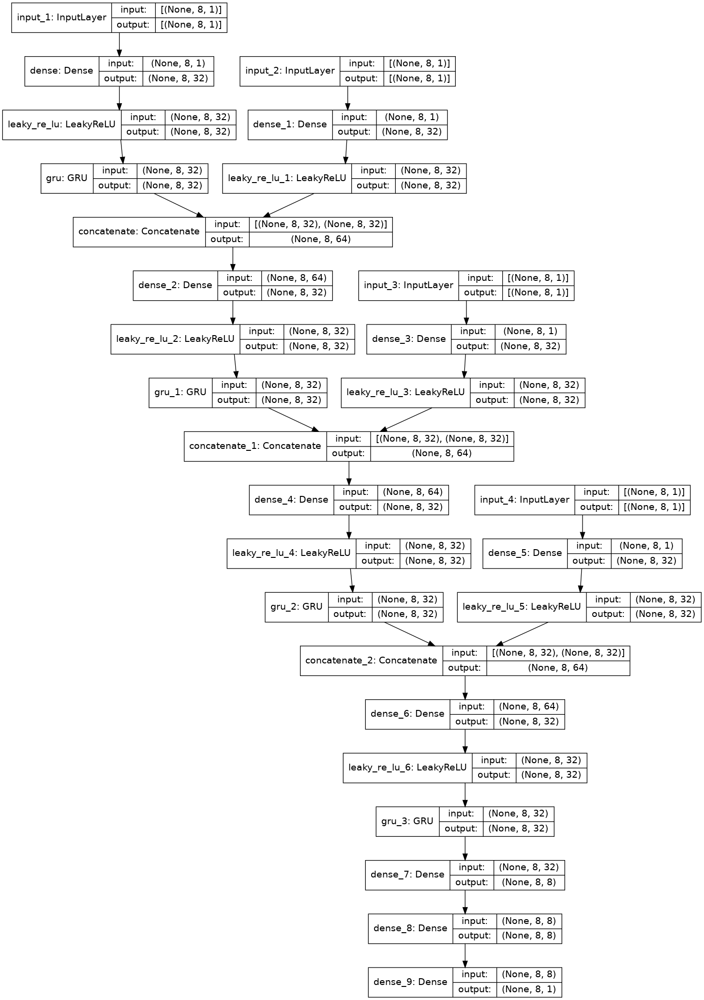

# 记录
## 数据可视化
### 目前一条试验路径在13天的数据分布

左下角注明了各颜色对应的路段。横轴代表从8-22点，采样间隔5分钟的时间点。***目前，我打算试一下仅根据晚高峰的旅行时间来聚类，以及kmeans算法***。

### 时空关联矩阵
Day 1

Day 7

Day 13

## 疑问：
1. 如何解释聚类算法在所设计的网络中起的作用？
   
    目前我参考的这个模型是建立在已找到路段之间关联比较大的情况下。原作者是通过trajectory data来找到一些流量比较大的路径。这样的做法应该可以保证路段之间有较大的spatial relation，所以直接采用这种stacked LSTM模型，会有比较好的预测效果。

    而我目前将聚类和这种模型相结合的做法，感觉不大实用，而且实验的结果也无法体现聚类的优势。

    例如，对于现在试验的路径，在理想情况下可以被分类算法大约划分成5个cluster。

    如果在地图上具体研究每个cluster周围的建筑，可能会发现有不同的地理特性，导致在同一时段的旅行时间的变化会不一样。
    
1. 从其中三天的信息中，是否可以确认网络中用于转化数据维度的全连接层的激活函数需要使用sigmoid而不是类似线性的RELU呢？
   
    (网络结构图)
    
